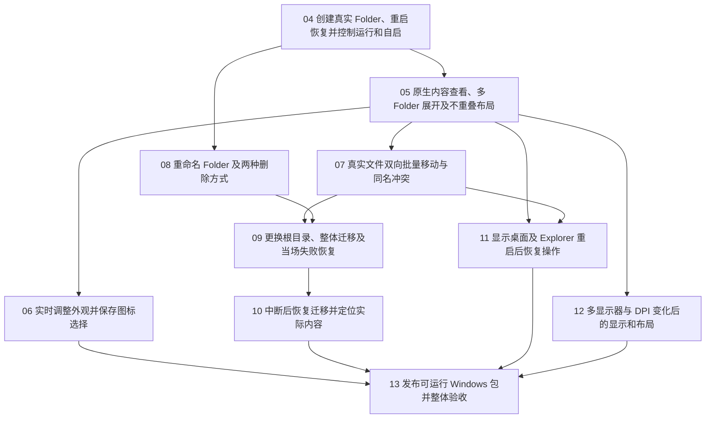

# 正式实现任务与依赖

Status: published
Implementation: ticket-04-resolved; remaining-deferred-by-user
Approved: 2026-10-02
Source: spec.md
Published tickets: 04–13

## 合并调整

用户已认可合并方案，将首轮 14 项调整为以下 10 项：

- 原 04＋14：创建、重启恢复与运行／自启设置，合并为新 04。
- 原 05＋06：内容查看和布局交互，合并为新 05。
- 原 08＋09：文件移入和移出，合并为新 07。
- 原 10＋11：重命名和两种删除，合并为新 08。
- 外观、整体迁移、中断恢复、桌面会话恢复、多屏／DPI、发布仍保持可独立验收的任务。

编号接续现有 01–03 历史记录。各任务已逐票发布到 issues 并标记 ready-for-agent。首轮 14 项材料作为对照保存在 review-history/14-ticket-proposal；现有历史任务及父规格保持不变。

## 拆分与阻塞关系

1. **04：创建真实 Folder、重启恢复并控制运行和自启**。阻塞：无。交付：启动正式程序，通过托盘／快捷键创建真实目录和桌面头部，重启恢复；在设置中开启／关闭自启，关闭设置后继续运行，明确退出释放运行资源。存储根目录默认为 `D:\KageFiles\`，不可用时明确选择其他可用目录。见 [04 任务](issues/04-create-lifecycle.md)。
2. **05：原生内容查看、多 Folder 展开及不重叠布局**。阻塞：04。交付：在头部下方查看真实内容，切换原生网格／列表、打开项目并同步外部变化；多个 Folder 同时展开，可贴边拖动、立即反向、调尺寸并保存不重叠布局。见 [05 任务](issues/05-content-and-layout.md)。
3. **06：实时调整外观并保存图标选择**。阻塞：05。交付：使用调色盘、RGB／HEX 和实时透明度滑块设置外观，应用／取消修改，并在重启后保持每个 Folder 的样式及 D 图标等候选选择。见 [06 任务](issues/06-appearance-and-icons.md)。
4. **07：真实文件双向批量移动与同名冲突**。阻塞：05。交付：在桌面、资源管理器及多个 Folder 之间真实移动文件、快捷方式和普通子文件夹，支持多选、同名选择、取消与逐项结果，内容与展示保持一致。见 [07 任务](issues/07-file-moves-and-conflicts.md)。
5. **08：重命名 Folder 及两种删除方式**。阻塞：04。交付：从头部菜单同步重命名真实目录，或选择保留内容并生成实际桌面快捷方式／完整目录进回收站；稳定标识、内容及状态与结果一致。见 [08 任务](issues/08-rename-and-delete.md)。
6. **09：更换根目录、整体迁移及当场失败恢复**。阻塞：07、08。交付：在设置中更换根目录，迁移所有内容目录及关联快捷方式目标，显示进度；当场失败或取消时保留旧配置并尝试恢复，持久记录未完成操作。见 [09 任务](issues/09-change-root-and-rollback.md)。
7. **10：中断后恢复迁移并定位实际内容**。阻塞：09。交付：迁移中断或恢复不完整后重启，核对真实文件路径，展示未完成清单，允许定位内容和重试恢复，不盲目重复移动或覆盖。见 [10 任务](issues/10-recover-interrupted-migration.md)。
8. **11：显示桌面及 Explorer 重启后恢复操作**。阻塞：05、07。交付：在显示桌面和 Explorer 重启后恢复 Folder、托盘、输入和真实拖放；宿主不可用时说明展示状态并允许定位实际内容。见 [11 任务](issues/11-desktop-session-recovery.md)。
9. **12：多显示器与 DPI 变化后的显示和布局**。阻塞：05。交付：在跨屏、负坐标、缩放、分辨率及显示器变化后保持原生内容尺寸、可见位置、不重叠布局和正确输入。见 [12 任务](issues/12-display-dpi-recovery.md)。
10. **13：发布可运行 Windows 包并整体验收**。阻塞：06、10、11、12。交付：获得可直接运行的正式发布包及说明，核对各功能组合流程、真实文件结果、持久设置和发布位置下的自启与桌面兼容性。见 [13 任务](issues/13-publish-and-accept.md)。

## 依赖图

## 粒度与依赖理由

- 04 在创建／重启及运行设置闭环中建立正式程序、稳定状态和共用操作 interface，之后 05 与 08 可以独立开展。
- 05 同时验收内容布局和窗口布局，完整覆盖用户已经确认的桌面交互；06 专注外观，07 专注文件双向移动。
- 08 的重命名和删除不依赖拖入界面，可用外部写入内容独立演示，保留目录／快捷方式关联供 09 迁移。
- 09 使用 07 的真实移动与冲突结果及 08 的保留内容关联；10 单独完成中断后启动恢复，控制恢复任务的上下文规模。
- 11 验收桌面会话恢复后的完整窗口和真实文件拖放，依赖 05、07；12 的显示环境适配可以基于 05 独立开展。
- 13 只依赖分支终点 06、10、11、12，传递依赖覆盖其余任务。每票都有自己的验收，最终发布增加组合流程检查。

## 用户故事覆盖

| 任务 | 主要故事编号 |
| --- | --- |
| 04 | 1, 2, 3, 4, 5, 6, 7, 8, 9, 14, 25, 61, 62, 63, 64, 65, 66, 67, 71 |
| 05 | 9, 10, 11, 12, 13, 14, 15, 16, 17, 18, 19, 20, 21, 22, 23, 24, 25, 26, 27, 28, 29, 30, 31, 32, 33, 34, 35, 50 |
| 06 | 8, 25, 37, 38, 39, 40, 41, 67 |
| 07 | 42, 43, 44, 45, 46, 47, 48, 49 |
| 08 | 36, 47, 49, 50, 51, 52, 53, 54 |
| 09 | 6, 7, 55, 56, 57, 58, 60 |
| 10 | 25, 58, 59 |
| 11 | 62, 65, 66, 68, 69 |
| 12 | 26, 27, 28, 29, 30, 31, 32, 70 |
| 13 | 72；整体验收覆盖 1–72 |

覆盖以 04–12 的功能交付加 13 的发布交付核对，不以最终整体验收掩盖未安排的功能。

## 领取与发布约定

- 用户已明确调用 `implement` 实施 04，现已完成并验收；其余任务待用户明确要求后再领取。下述可处理队列是依赖顺序，不构成自动开工授权。
- 用户已认可合并后的 10 项任务、依赖关系和各票验收标准，任务已正式发布。
- 每票独立保存源规格、阻塞项和验收标准；ready-for-agent 不表示阻塞已经解除。
- 第一项是 04；完成后初始可处理队列为 05、08，其后只有所有阻塞项完成才能领取。
- 原型分支保留；每票在独立上下文中按 /implement 流程完成，结果记录在对应任务。

## 确认记录

- 2026-10-02：用户明确启动 04；正式创建／恢复／运行和自启闭环完成，业务检查与真实 Windows 会话验收通过，结果记录于 04 的 Answer。05、08 的依赖已解除，尚未自动领取。
- 用户于 2026-10-02 认可本合并方案，已发布 04–13 共 10 项任务。
- 本次认可包含草案列出的共用操作 interface、隔离目录业务检查及真实 Windows 会话验收方式。
- 原型历史任务和父规格保持不变；实施从无阻塞的 04 开始。
- 用户于 2026-10-02 要求暂不开始实施，已记录并保持所有实现任务未领取。
