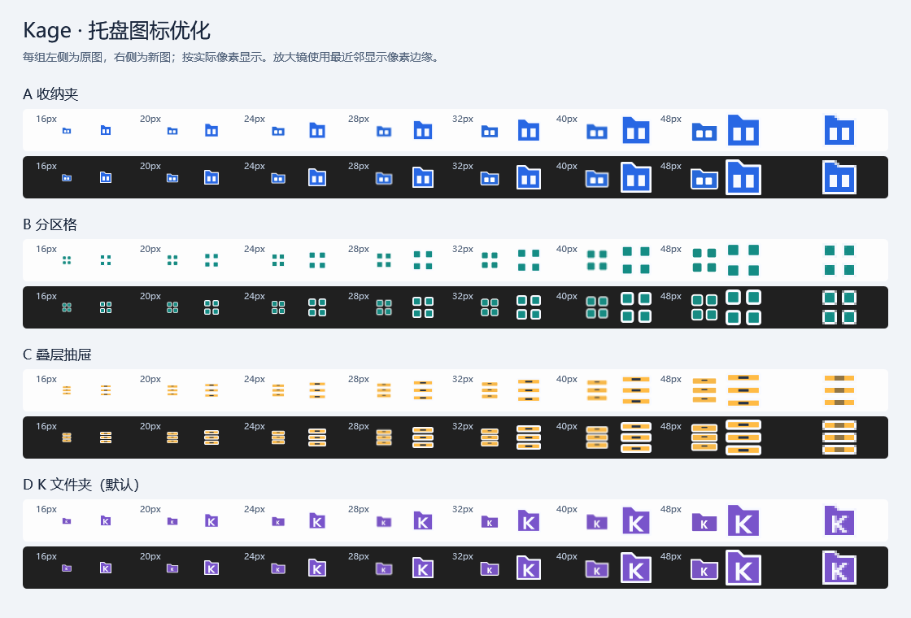

# 04 托盘图标设计与方案切换验收

验收日期：2026-10-07。对应[票据 04](../../.scratch/desktop-tool-upgrade/issues/04-tray-icon-design.md)，实现前基线为 `271b94d0d3226be9e348be31ccf118020ad1a82a`。

## 图形与资源规则

保留 A 收纳夹、B 分区格、C 叠层抽屉、D K 文件夹。默认 D，已有 `IconChoice` 不变，继续通过 `IDesktopWorkspace.SetIconAsync` 保存。应用窗口仍使用对应 `app-*.png`，EXE 固定内置 `app-d.ico`；托盘使用重新绘制的 `tray-*.ico`。本票只优化托盘图形，应用图标与既有四套方案的对应关系保持一致。



每组左边为基线 ICO 中最接近目标尺寸的原帧，右边为新资源的目标帧。16、20、24、28、32、40、48px 均按实际像素展示；最右侧为新 16px 图形的三倍像素放大。浅色／深色背景仅是视觉对照，不能替代对应系统主题的真实会话验收。

以 alpha ≥ 32 的像素范围衡量有效图形，原图数据来自原 256px PNG：

| 方案 | 原图有效范围 | 原图宽／高占比 | 新 16px 有效范围 | 新 24px 有效范围 |
| --- | --- | --- | --- | --- |
| A | 182×136 | 71.1%／53.1% | 14×14 | 22×22 |
| B | 172×172 | 67.2%／67.2% | 14×14 | 22×22 |
| C | 172×176 | 67.2%／68.8% | 14×14 | 22×22 |
| D | 182×136 | 71.1%／53.1% | 14×14 | 22×22 |

每套 ICO 包含 16—80px 的每个整数尺寸，以及 96、128、256px，共 68 个 32 位透明 PNG 帧。16—80px 覆盖 100%—500% 自定义缩放的小图标度量，包括 225% 的 36px、275% 的 44px。各尺寸从矢量独立绘制，保留至少一个实际透明像素的安全边距；白色轮廓适配深色背景，彩色填充适配浅色背景。K 使用路径绘制，避免字体替换。源代码和可复现生成器位于 `tools/TrayIconGenerator/`。

运行时读取主任务栏窗口 DPI，通过 `GetSystemMetricsForDpi(SM_CXSMICON/SM_CYSMICON)` 明确选择帧，并通过原生 `LoadImage` 加载请求尺寸；任务栏不存在时使用系统 DPI。显示环境刷新会重新核对尺寸，Explorer 恢复时也重新核对，然后复用原 NotifyIcon、菜单和控制器。Windows 的通知区域使用小图标度量，见 [Microsoft 图标尺寸说明](https://learn.microsoft.com/en-us/windows/win32/menurc/about-icons)。

## 自动检查与真实 Windows 会话

- 资源检查先于更新资源运行，确实因旧 ICO 缺少完整尺寸帧失败；最终四套共 272 帧全部通过。检查实际输出中的 ICO 文件头、唯一帧尺寸、PNG 解码、有效面积、四边透明、Windows 原生加载和 EXE 内置 D。`System.Drawing.Icon` 对 256px 帧会选到 128px，资源检查改用原生 `LoadImage`，确认 Windows 能以 256px 加载。
- `--tray-session-check` 使用随机临时目录和唯一托盘提示名称，通过真实鼠标右键打开 Explorer 通知区域菜单，逐一选择 A／B／C／D。核对实际 NotifyIcon 像素、菜单勾选和已打开窗口图标，保存四个按钮的真实截图。唯一名称避免误点当前已经运行的正式实例。
- 使用真实状态文件共享锁阻止原子替换，保存 A 失败时，托盘、窗口、勾选和磁盘偏好保持已提交 D；解除锁后可保存 B。销毁运行时并重新读取磁盘状态，恢复 B；恢复后的真实菜单仍可切换到 C。
- `--desktop-recovery-check` 在当前会话确认没有 Explorer 文件操作，记录并恢复目录窗口，然后实际结束并重新启动桌面宿主。B 图标、原控制器、热键注册状态、同一个 NotifyIcon 和菜单均保持；恢复后真实双击打开唯一设置窗口，真实菜单可切换 C。随后真实 Folder 命中、展开、拖动、缩放及 Explorer OLE 拖入／拖出检查通过，内容字节和保留内容关联保持。
- 恢复脚本同步适配已完成的票据 02：使用明确的 `ResizeGrip`，避免将新增头身分隔线误判为唯一 Thumb。允许当前已有实例占用热键，恢复前后仍核对注册状态及原控制器，且不关闭既有实例。

实际环境：Windows `10.0.26300.0`，单屏 150%，浅色任务栏，运行时使用 **24×24px** 帧。已目视检查真实 A／B／C／D 按钮和两种背景的小尺寸预览。真实深色系统主题、其他系统 DPI、混合 DPI、多屏、切换主屏及动态更改系统缩放尚未实际验证；全部资源帧的解码／加载检查不能代替这些环境的真实显示检查。

本机日志与真实截图保存在忽略目录 `.scratch/desktop-folder/verification/`：`tray-icon-resources.txt`、`tray-session.txt`、`desktop-recovery-session.txt`、`04-真实托盘-a.png` 至 `04-真实托盘-d.png`。这些脚本均使用随机隔离状态，不写入正式工作区或自启配置；结束后清理夹具和窗口，专用托盘检查还恢复鼠标位置。

## 构建与发布资源核对

Release 完整重建：0 警告、0 错误。完整 63 项业务回归通过，图标偏好覆盖默认 D、四套保存与重启、非法值及保存故障。正式发布仍由票据 05 负责，本票使用全新且含空格的隔离目录核对自包含包资源。

项目配置继续将八个应用／托盘 ICO 复制到输出和发布目录，将四个应用 PNG 嵌入 WPF 程序集。发布检查现在也执行完整图标资源检查，缺少任何方案或帧时返回失败。包内 EXE 检查同时确认加载包内 .NET、WPF 及 Windows App SDK 依赖。

最终全新目录 `upgrade-04 审查后资源` 中，包内 `--publish-check` 和 `--tray-session-check` 均退出码 0；四套共 272 帧检查通过，八个 ICO 的 SHA256 与源文件一致，Assets 文件集合恰为这八个文件。修复后的 Release EXE 再次执行实际 Explorer 重启、恢复和 OLE 检查，退出码 0。

复验命令（真实 UI 检查需在当前交互式 Windows 会话串行执行，并使用带 PerMonitorV2 清单的 EXE）：

```powershell
rtk proxy dotnet run --project tests/Kage.Workspace.Checks --no-restore
rtk proxy dotnet build src/KageDesktopTool/KageDesktopTool.csproj -c Release --no-restore -t:Rebuild
rtk proxy src/KageDesktopTool/bin/Release/net10.0-windows10.0.19041.0/win-x64/KageDesktopTool.exe --tray-icon-check
rtk proxy src/KageDesktopTool/bin/Release/net10.0-windows10.0.19041.0/win-x64/KageDesktopTool.exe --tray-session-check
rtk proxy src/KageDesktopTool/bin/Release/net10.0-windows10.0.19041.0/win-x64/KageDesktopTool.exe --desktop-recovery-check
rtk proxy dotnet publish src/KageDesktopTool/KageDesktopTool.csproj -p:PublishProfile=WindowsX64 --no-restore -o '.scratch/desktop-folder/verification/upgrade-04 审查后资源'
rtk proxy '.scratch/desktop-folder/verification/upgrade-04 审查后资源/KageDesktopTool.exe' --publish-check
rtk proxy '.scratch/desktop-folder/verification/upgrade-04 审查后资源/KageDesktopTool.exe' --tray-session-check
```

生成器命令如下；对照预览的第一个参数须指向基线 `271b94d` 的原始托盘 PNG／ICO，避免把更新后的图标当作原图。

```powershell
rtk proxy dotnet run --project tools/TrayIconGenerator -- src/KageDesktopTool/Assets src/KageDesktopTool/Assets docs/verification/assets/upgrade-04-tray-icons.png
```

## Standards

独立审查及修复复审最终 0 项遗留。中文开发文本、领域术语、资源生成和检查职责符合仓库约定。原生图标加载所得句柄在 `finally` 释放，返回的 Clone 独立拥有 HICON，并由现有运行时生命周期释放；未发现新增的实质性维护问题。

## Spec

首次独立审查指出 1 项 P2：225%／275% 需要 36／44px 帧，原候选资源会选择 32／40px，导致放大显示和缓存失效。已扩展至 16—80px 每个整数尺寸，并改用原生尺寸加载；审查代理另行实测四套的 36／44／80／256px 加载及 Clone 句柄释放后可读性。复审最终 0 项遗留，无范围扩张。其他真实系统主题和 DPI 的覆盖边界仍按上文记录。
